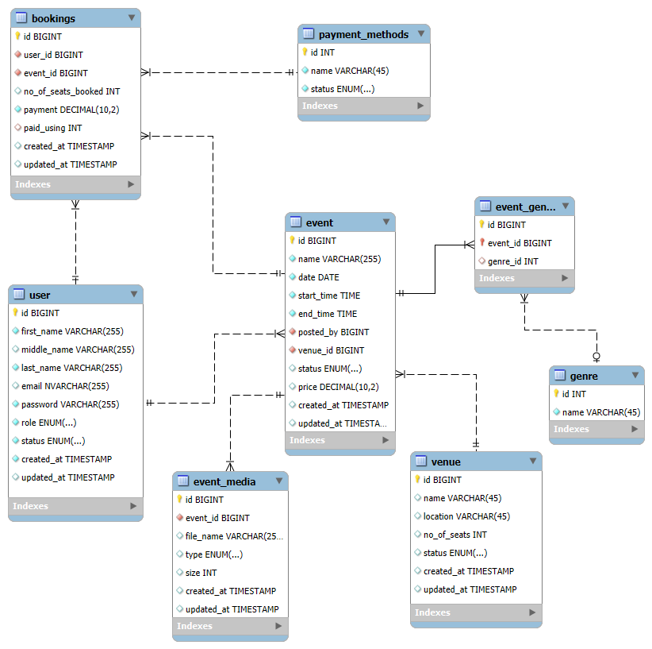

# INSTAILY ACADEMY WEB DEVELOPMENT BOOTCAMP 2024
## Event Management System

### Objective

To implement an event management system 

### Planned Features

1. User can view and buy tickets to an event 
2. User can post an event

### Proposed Website Design

Please refer to attached figma link [NOTE: Needs to be properly documented]

https://www.figma.com/design/H1D9Hbsgnt0ZP5LiSmuwW4/EMS-Plan?node-id=0-1&node-type=canvas&t=aGHHmzMu1nnFdaKv-0

### Planned Database Design

<figure>
    
    <figcaption><b>EMS Database Plan Layout</b></figcaption>
</figure>

Please refer to given workbench file

### Technologies Used

Django Framework

## Instructions

1. Dowload the event_management_system directory
2. You need a virtual environment to install and use Django.
    - First, go to the command line and make sure you are in the same directory as the downloaded directory.
    - Then enter the following command: <code>python -m venv venv</code>
    - Then, to activate, type the following command: 
        + For Linux: <code>source venv/bin/activate</code>
        + For Windows: <code>venv/Scripts/activate</code>
            - Note: If an error occurs, you may need to run the command <code>Set-ExecutionPolicy Unrestriced -Scope Process</code>
    - Then, install Django using the command: <code>python -m pip install Django</code>
3. Go into the event_management_system directory from the command line.
4. Run the command to make initial migration to enable Django features: <code>python manage.py migrate</code>    
5. Run the server using the command <code>python manage.py runserver</code>, and access it via the link https://127.0.0.1:8000/

## Web Apps Developed

+ hello_world 
Basic Hello World to test Django functionality. 
URL: https://127.0.0.1:8000/hello_world

+ login_page 
Basic Login Page to check out Login, Signup And Logout methods. 
URL: https://127.0.0.1:8000/login_page
